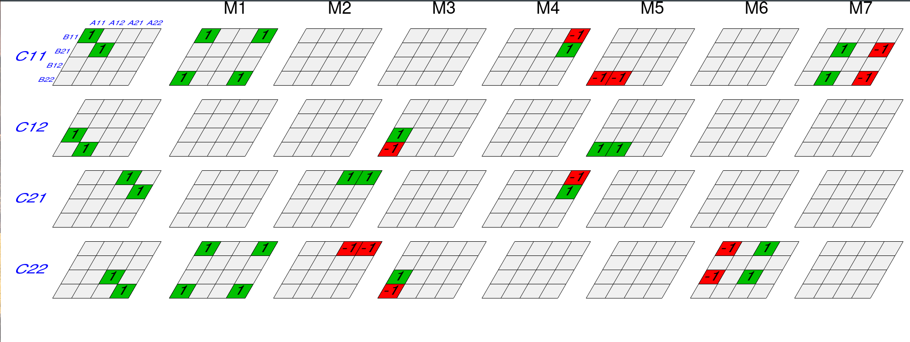

# 分治策略

## 矩阵乘法

矩阵(方阵)乘法定义为:

给定两个 $n\times n$ 的矩阵 $A, B$, 求乘积矩阵的元素:

$$
(AB)_{ij} = \sum_{k=1}^n A_{ik} B_{kj}
$$

最直接的算法由如下的代码实现:

```python{.line-numbers}
def sqrMatrixProduct(A:list, B:list) -> C:
    n = len(A)
    C = [[0] * n]* n
    for i in range(n):
        for j in range(n):
            C[i][j] = 0
            for k in range(n):
                C[i][j] += A[i][k] * B[k][j]
    return C
```

不难看到, 它需要的时间复杂度为 $\Theta(n^3)$. 

## 矩阵乘法的 Strassen 算法

### 朴素分治算法

一个朴素的分治法通过假设矩阵维数为 $2$ 的整数幂, 即 $n =2 ^k$. 非此情形可以通过补 $0$ 或者分离为其他更小的矩阵来实现, 但这些都不会在复杂度 scaling 上造成影响, 因为:

$$
P(2^{\textrm{floor}(\log n) + 1}) = P(n \times 2^{\textrm{floor}(\log n) + 1 - \log n}) = P(n\times 2^{1-\delta}) = P(n)
$$

其中, $P(\cdot)$ 指多项式. 假设 $n=2^k$, 从而每次都只需要处理 $2\times 2$ 的 $\Theta(1)$ 个 $2^{k-1}\times 2^{k-1}$ 子矩阵之间的乘法运算. 朴素的分治算法计算如下矩阵乘法:

$$
A = \begin{bmatrix} A_{11} & A_{12} \\ A_{21} & A_{22}\end{bmatrix}, B= \begin{bmatrix} B_{11} & B_{12} \\ B_{21} & B_{22}\end{bmatrix}, C = \begin{bmatrix} C_{11} & C_{12} \\ C_{21} & C_{22}\end{bmatrix}, 
$$

从而

$$
C_{mn} = \sum_{k=1}^2 A_{mk}B_{kn} \ , \ m,n\in\{1,2\}
$$

共需要进行 $8$ 次的子矩阵乘法, 以及 $4$ 次 $n/2\times n/2$ 的矩阵加法. 而分解分块矩阵通过下标操作可以规避时间复杂的, 从而我们有递推关系的时间复杂度:

$$
T(n) = \begin{cases}
\Theta(1) & n=1 \\
8T(n/2) + \Theta(n^2) & n\gt 1
\end{cases}
$$

仿照前面的分析, 我们给出:

$$
\begin{aligned}
T(n) &= 8T(n/2) + \Theta(n^2) \\
&=8^2 T(n/4) + \Theta(n^2) + 8 \Theta((n/2)^2) \\
&\cdots\\
&=8^{l} T(n/2^l) + \Theta(n^2) + 8\Theta(n^2 / (2^1)^2) + \cdots + 8^{l-1}\Theta(n^2 / (2^{l-1})^2) \\
&=8^k + \sum_{l=0}^{k-1}\frac {8^l} {2^{2l}} \Theta(n^2) \\
&=n^3 + (2^k-1) \Theta(n^2) \\
&=\Theta(n^3)
\end{aligned}
$$

注意到我们使用了 $k = \log n$ 的性质. 

从而我们看到, 朴素分治算法并没能有效地为我们提供更快的矩阵乘法算法. 

## Strassen 算法的优化

Strassen 算法事实上提供了计算矩阵乘法和加法的优化, 他注意到朴素的分块矩阵运算事实上进行了某种重复:



上图(来自 [Wikipedia//Strassen_algorithm](https://en.wikipedia.org/wiki/Strassen_algorithm))四层代表了 $C$ 的四个分块, 而用 $4\times 4$ 的格子代表执行的矩阵乘法与加法. 朴素的分块矩阵乘法事实上就是这样的 $16$ 维空间的 $4$ 个向量, 如上图最左侧一列. Strassen发现了右边的 $7$ 列的实现, 使得 $M_1+\cdots+M_7$ 恰好为朴素的 $4$ 个构型. 而这 $M_1\sim M_7$ 中涉及到的独立矩阵乘法运算只有 $7$ 个 (相差一个系数的被识别为相同). 其中 $M_{2\sim 5}$ 中只有一个矩阵乘法是显然的, 而

$$
\begin{aligned}
M_1 &= (A_{11} + A_{22})(B_{11}+B_{22}) = A_{11}B_{11}+A_{11}B_{22}+A_{22}B_{11}+A_{22}B_{22} \\
M_6 &= (-A_{11}+A_{21}) (B_{11}+B_{12}) = -A_{11}B_{11}-A_{11}B_{12}+A_{21}B_{21}+A_{21}B_{12} \\
M_7 &= (A_{12}-A_{22})(B_{21}+B_{22}) = A_{12}B_{21}+A_{12}B_{22}-A_{22}B_{21}-A_{22}B_{22}
\end{aligned}
$$

从而 Strassen 算法能够实现

$$
T(n) = \begin{cases}
\Theta(1) & n=1 \\
7T(n/2) + \Theta(n^2) & n\gt 1
\end{cases} \Rightarrow T(n) = \Theta(n^{\log_2 7}) =O(n^{2.81})
$$

的优化矩阵乘法. 

## Strassen 算法的其他应用

仿照 Strassen 算法, 我们可以实现一个仅 $3$ 次乘法计算的实现两个复数相乘的算法:

$$
(a+b\ti) \times (c+d\ti) = (ac - bd) + (ad + bc)\ti
$$

我们仿照上面对 Strassen 算法的分析, 此时不再需要 $4$ 个矩阵

$$
\begin{aligned}
(ac-bd) &= \begin{bmatrix}c&d\end{bmatrix}\begin{bmatrix}1 & 0 \\ 0 & -1\end{bmatrix}\begin{bmatrix}a \\ b\end{bmatrix} = \begin{bmatrix}c&d\end{bmatrix}\bm{Z}\begin{bmatrix}a \\ b\end{bmatrix} \\
(ad+bc) &= \begin{bmatrix}c&d\end{bmatrix}\begin{bmatrix}0 & 1 \\ 1 & 0\end{bmatrix}\begin{bmatrix}a \\ b\end{bmatrix} = \begin{bmatrix}c&d\end{bmatrix}\bm{X}\begin{bmatrix}a \\ b\end{bmatrix}
\end{aligned}
$$

能够对应一次乘法运算的分量必须满足: 

$$
\bm{P}\bm{A}\bm{Q} \in \{\begin{bmatrix}1 & 0 \\ 0 & 0\end{bmatrix}, \begin{bmatrix}0 & 1 \\ 0 & 0\end{bmatrix}, \begin{bmatrix}0 & 0 \\ 1 & 0\end{bmatrix}, \begin{bmatrix}0 & 0 \\ 0 & 1\end{bmatrix}\}
$$

其中 $\bm{P},\bm{Q}$ 为正交变换. 从而我们必须用一组秩为1的矩阵来对 $\bm{Z}, \bm{X}$ 进行分解. 在 $2\times 2$ 的矩阵中, rank-1 矩阵可以表示为

$$
\bm{B}(x) = \begin{bmatrix} \mu\bm{x}& \lambda \bm{x}\end{bmatrix} \ ; \ \bm{x}\in\mathbb{R}^2
$$

从而我们可以看到, 如果我们需要 $r$ 个这样的矩阵来分解 $\bm{Z}=\sum_{i=1}^r z_r \bm{B}_r, \bm{X}=\sum_{i=1}^r x_r \bm{B}_r$, 我们应当有:

$$
\begin{aligned}
\sum_{i=1}^r z_r \mu_r \bm{x}_r &= (1,0)^T \\
\sum_{i=1}^r z_r \lambda_r \bm{x}_r &= (0, -1)^T \\
\sum_{i=1}^r x_r \mu_r \bm{x}_r &= (0, 1)^T \\
\sum_{i=1}^r x_r \lambda_r \bm{x}_r &=(1, 0)^T
\end{aligned}
$$

从而我们看到. 至少需要 $r=2$. 如果假设存在这样的 $r=2$, 对应两个线性无关矢量 $\bm{x}_1, \bm{x}_2$, 则我们很容易通过整理上面四个方程, 使用 $1-4, 2+3$ 得到零矢量以及对叠加系数的要求(注意 $\bm{x}_{1,2}$ 线性独立)

$$
\begin{aligned}
z_r \mu_r - x_r \lambda_r &= 0 \\
z_r \lambda_r + x_r \mu_r &= 0
\end{aligned} \ , \ r= 1, 2
$$

即: $(z_r+x_r \ti)(\mu_r+\lambda_r \ti)=0$. 换言之 $(z_r^2+x_r^2)(\mu_r^2+\lambda_r^2) = 0$. 我们要求 $\lambda_r,\mu_r$ 不能为 $0$, 否则同我们假设两个线性独立的成分 $r=2$ 矛盾. 但这意味着 $x_r=z_r =0$, 即 $\bm{Z},\bm{X} = 0$. 故不可能.

因此可行的分解至少需要 $3$ 个rank-1矩阵, 亦即我们至少要做 $3$ 次乘法运算. 在这种情况下的实例可以选择:

$$
\bm{a} = \begin{bmatrix} 0 & 0 \\ 1 & -1\end{bmatrix} \ , \ \bm{b} = \begin{bmatrix}0 & 1 \\ 0& 1 \end{bmatrix} \ , \ \bm{c} = \begin{bmatrix}1 & 0 \\ -1& 0 \end{bmatrix}
$$

从而

$$
\bm{Z} = \bm{a} + \bm{c} \ , \ \bm{X} = \bm{a} + \bm{b}
$$

而对应的乘法计算:

$$
\begin{aligned}
A &= (c,d)\bm{a}(a,b)^T = d(a-b) \\
B &=(c,d)\bm{b}(a,b)^T = (c+d) b \\
C &=(c,d)\bm{c}(a,b)^T = (c-d) a
\end{aligned}
$$

从而:

$$
(a+b\ti) (c+d\ti) = (A+C) + (A+B) \ti
$$

共需 $3$ 次乘法运算. 