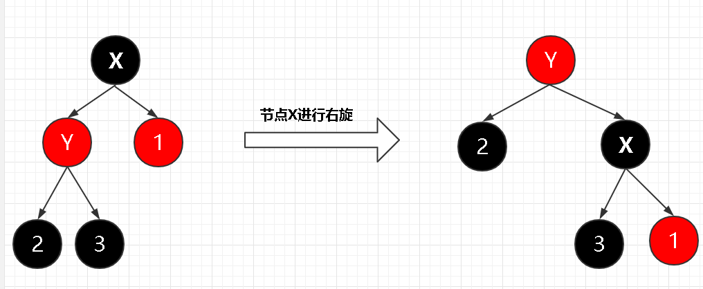
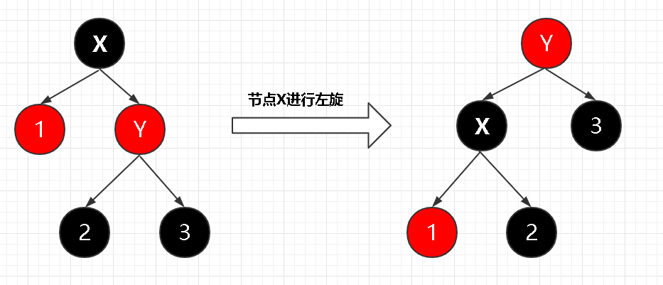

# 红黑树

## 旋转

二叉搜索树中只有插入和删除节点可能导致红黑树的特性被破坏, 这一部分我们讨论如何重写它们. 其核心在于一种叫做 **旋转** 的操作. 

**旋转(rotation)** 是搜索树上的一种局部操作. 

1.  右旋 (right-rotate)

    对于一个拥有非空左子结点的节点可以定义右旋操作, 我们使用 (node -> (node.left, node.right)) 的形式来表示节点关系, 右旋操作如下改变这个部分:

    ```
    r -> y                                r -> x
    y -> (x, f3)        ---------->       x -> (f1, y)
    x -> (f1, f2)                         y -> (f2, f3)
    ```

2.  左旋 (left-rotate)

    左旋定义在拥有非空右子结点的节点上, 它事实上就是右旋的逆操作.

图示更加清晰:




(图片引用自博客 [@jianshujoker](https://www.jianshu.com/p/ab90c2ec07e4))

从而我们不难给出实现这些操作的代码, 注意这种局部操作只修改了存储节点关系的列表而不调整节点的值. 

```python{.line-numbers}
class bhTree(binSearchTree):
    # Other methods
    def rightRotate(self, x):
        if self.isEmpty(self.left(x)):
            print("Empty left child, leave tree unchanged")
            return
        
        y = self.left(x)
        p = self.par(x)

        # Modify the child of p into y
        if x == self.root:
            # discuss root separately, since p(root) = None
            self.root = y
        elif x == self.left(p):
            self.leftInd[p] = y
        else:
            self.rightInd[p] = y
        self.pInd[y] = p
        self.pInd[x] = y

        # Modify subtree belonging
        self.rightInd[y], self.leftInd[x] = x, self.rightInd[y]
```

## 插入节点

我们可以在 $O(\log n)$ 的时间内完成向一个含有 $n$ 个节点的红黑树中插入一个新的节点.

回忆在二叉搜索树中的插入操作, 我们通过按照搜索树进行搜索找到一个合适的叶节点位置, 然后将输入元素插入树中. 红黑树的插入操作将额外将该节点置红色, 然后调用一个修复红黑树性质的子程序来确保红黑树性质是保持的. 

_为什么不把新节点置黑色?_ : 如果将其置为黑色, 那么从其父节点开始向叶节点的不同简单路径上会拥有不同数量的黑色节点. 这将会破坏红黑树的性质5: "对每个节点, 从该节点到其所有后代叶节点的简单路径上, 均包含相同数目的黑色节点. ", 使得性质修复更加困难. 而如果置红色, 则性质5不会破坏而仅破坏性质4, 可以相对容易地进行修复(因为不需要增加或减少黑节点数量.)

我们接下来开始分析红黑树的插入操作. 注意我们使用原本的二叉搜索树的插入操作, 因此插入节点的位置总是叶子(在红黑树中, 应当是一个叶子的父节点, 因为我们为每个原始的"叶节点"加入了两个空的, 黑色的孩子). 插入节点被置为红色. 

这种插入操作将会破坏红黑树的性质 2. 根节点是黑色的, 和 4. 每个红节点的两个孩子都是黑色的. 我们来分析如下的实现:

```python{.line-numbers}
class rbTree(binSearchTree):
    def insert_fix(self, ptr):
        # Fix the insert operation
        def isLeftChild(x):
            return x == self.left(self.par(x))
        def setBlack(x):
            self.color[x] = True
        def setRed(x):
            self.color[x] = False

        while not self.isBlack(self.pInd[ptr]):
            if isLeftChild(self.par(ptr)):
                y = self.right(self.par(self.par(ptr)))
                if not self.isBlack(y):
                    setBlack(self.par(ptr))
                    setBlack(y)
                    setRed(self.par(y))
                    ptr = self.par(self.par(ptr))
                elif not isLeftChild(ptr):
                    ptr = self.par(ptr)
                    self.leftRotate(ptr)
                setBlack(self.par(ptr))
                setRed(self.par(self.par(ptr)))
                self.rightRotate(self.par(self.par(ptr)))
            else:
                y = self.left(self.par(self.par(ptr)))
                if not self.isBlack(y):
                    setBlack(self.par(ptr))
                    setBlack(y)
                    setRed(self.par(y))
                    ptr = self.par(self.par(ptr))
                elif not isLeftChild(ptr):
                    ptr = self.par(ptr)
                    self.leftRotate(ptr)
                setBlack(self.par(ptr))
                setRed(self.par(self.par(ptr)))
                self.rightRotate(self.par(self.par(ptr)))
        
        setBlack(self.root)

    def insert(self, z):
        ptr = super().insert(z)
        self.setValue(ptr, color=False)
        self.insert_fix(ptr)
        return ptr
```

41行到45行的插入操作做了如下的事情:
1.  42行调用了父类(二叉搜索树)的插入操作, 并将插入节点的位置返回为 `ptr`
2.  43行为 `ptr` 的插入节点赋红色
3.  44行调用了 `insert_fix` 方法
4.  45行返回了插入节点的位置 `ptr`. 注意由于 `ptr` 始终为 `int` 对象, 因此 `44` 行的传参调用并不会修改它的值.

我们着重分析第2行开始的插入操作. 第4, 6, 8行定义的临时函数只是为了方便下面的书写, 它们的含义是显然的. 

我们证明11行开始的循环拥有如下的循环不变式:

在每个循环的 **开始** :
1.  节点 `ptr` 是红色的
2.  如果 `ptr.p` (`self.par(ptr)` 的简记) 是根节点, 那么 `ptr.p` 是黑节点
3.  如果有任何红黑性质被破坏, 啧至多只有一条被破坏. 或者是性质2, 或者是性质4. 性质2被破坏时是因为 `ptr` 是根且是红色的, 性质4被破坏是因为 `ptr` 和 `ptr.p` 都是红节点.