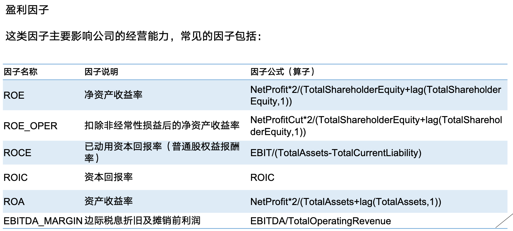
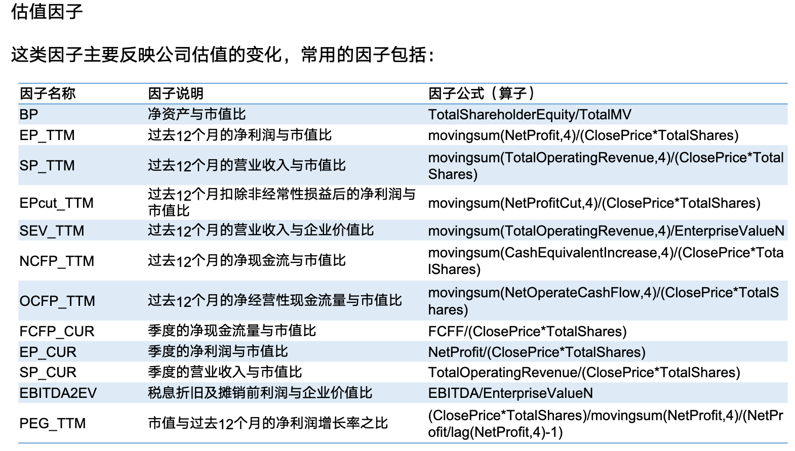
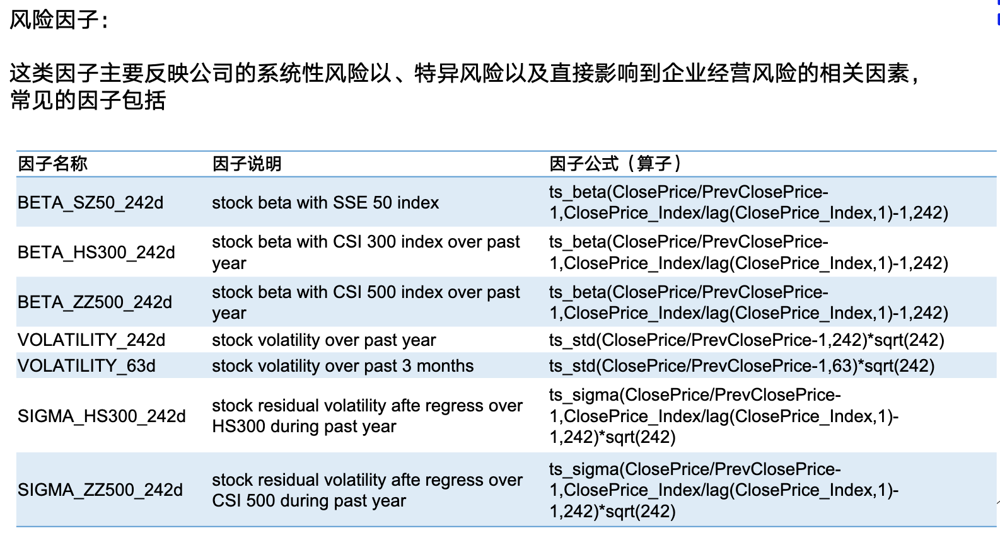
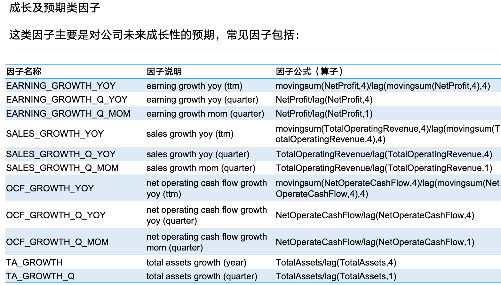
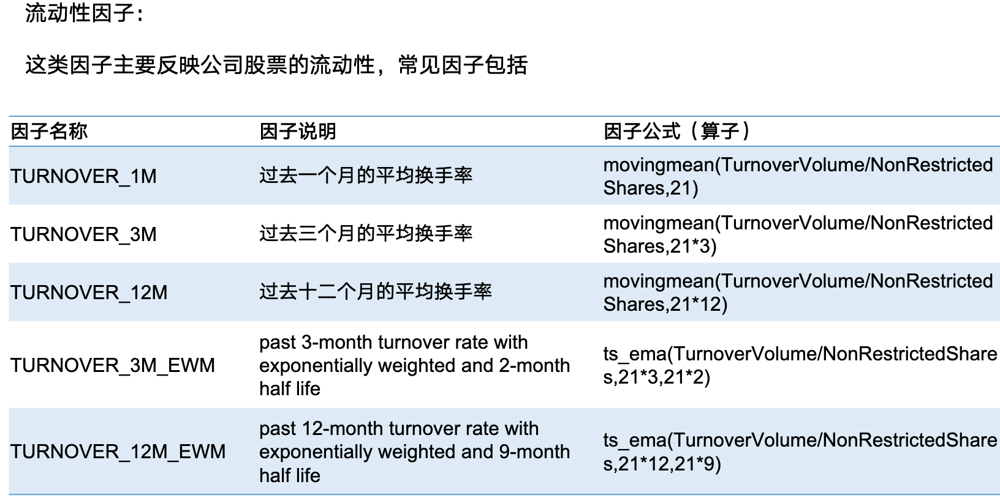

# 因子检验和因子开发

## 因子分类和定价逻辑

因子是从公司定价的共性因素去看待上市公司的股价变化. 因而在做因子挖掘时, 更需要关注因子背后的经济逻辑和其代表的意义

注意到公司股价(fair value)是公司未来的贴现. 不妨考虑这样的下一年贴现为 $E$, 公司贴现率为 $1+r$ (即下一年的名义金额 $x$ 在当年应当为 $x/(1+r)$), 公司的增长率为 $g$, 即下一年的预期名义分红为 $D(1+g)$. 从而:

$$
P = \sum_{i=1}^{\infty} E \frac {(1+g)^i} {(1+r)^i} = E \frac {(1+g)/(1+r)} {1 - (1+g)/(1+r)} = \frac {E(1+g)} {r-g}
$$

这个模型被称为 Gordon Growth Model(GGM). 分子上的 $(1+g)$ 可以吸收进分红 $E$ 中理解为次年的名义分红. 系数 $PE=1/(r-g)$ 被称为**估值水平**, $E(1+g)$ 被称为**盈利预期**

可以看到$r$同股价负相关, 而增长$g$呈现正相关. 如果公司增长超越贴现, 那么该模型失效. 推广的GGM会额外考虑公司破产风险和流动性溢价, 写为

$$
P = \frac {E'} {r+s+\gamma - g}
$$

其中 $s$ 为风险溢价(风险偏好, 流动性), $\gamma$ 为流动性溢价. 

现在我们来考虑投资者行为对股价的影响. 我们用期望效用理论来理解 $s$ 的值. 考虑效用函数为 $u$ 的投资者对回报率 $R$ (随机变量) 的期望效用, 假设他的持仓为 $x$:

$$
\begin{aligned}
\mathbb{E}u(x+ Rx) &\approx \mathbb{E} \Big(u(x) + u'(x) Rx + \frac 1 2 u''(x) R^2 x^2\Big) \\
&= u(x) + u'(x) x \mathbb{E}R + \frac 1 2 u''(x) x^2 \mathbb{E}R^2
\end{aligned}
$$

这意味着由于风险的存在 ($\mathbb{E}R^2$), 消费者对未来回报的效用变化事实上是会出现偏差的. 对于风险厌恶的消费者, $u' \gt 0, u'' \lt 0$, 风险的存在会减弱期望回报. 对此, 我们可以确定一个风险资产带来的期望效用收益:

$$
u(x + r x) = \mathbb{E} u(x + R x)
$$

从而给出:

$$
r = \mathbb{E}R + \frac 1 2 \frac {x u''(x)} {u'(x)} (\mathbb{E}R^2 - (\mathbb{E}R)^2)
$$

这里我们声明近似估计的道理: 期望回报 $\mathbb{E}R$ 和期望效用回报 $r$ 通常被认为是小量, 因此在左边的Taylor展开中我们只保留到 $r$ 的一级项. 而风险资产可以在小期望的情况下拥有大的方差, 因此在期望效用里我们展开到二阶. 

这个理论告诉我们投资者对风险的预期是和方差成正比的. 在统计上我们可以将上面的风险溢价 $s$ 改写为方差和一个系数. 换言之我们有:

$$
P = \frac {E'} {r+\lambda \sigma^2+\gamma - g}
$$

从而这个表示中的变量都拥有了确定可测的经济学含义: $r$ 代表无风险利率(贴现), $\gamma$ 为流动性溢价, $\lambda$ 为投资者风险偏好, $\sigma^2$ 为股票风险度量(波动率). 根据这个式子我们会给出股票回报的表达:

$$
\Delta \log P = \Delta \log E' - \frac {\Delta (r+\gamma)} {r+\lambda \sigma^2 + \gamma -g} - \frac {\Delta (\lambda \sigma^2)} {r+\lambda \sigma^2 + \gamma -g} + \frac {\Delta g} {r+\lambda \sigma^2 + \gamma -g} + \epsilon
$$

其中 $\epsilon$ 是投资者的定价偏差, 期望应当为0. 而这个表达式意味着

资本利得 = 盈利变化 + 估值变化 + 风险溢价变化 + 成长能力变化 + 市场定价偏差

### 常用因子分类

## 因子有效性分析

### 信息系数(IC)

信息系数 (information coefficient) 反应因子对下期收益率的预测能力. IC越高就表明因子在预测上的价值越高

1.  Normal IC

    又称皮尔逊相关系数, 是某个时间点上给定股票池, 所有股票的因子值和下期回报的相关系数:

    $$
    Normal~IC = \textrm{corr}(X_{t-1}, R_t)
    $$

2.  Rank IC

    又称斯皮尔曼相关系数, 不同于normal ic, 它是两个变量排序值的相关系数

    $$
    Rank~IC = \textrm{corr}(\textrm{Order}_{t-1}(X), \textrm{Order}_t (R))
    $$

    同 normal ic 相比, 它对变量的分布不做出假设, 因此受到异常值影响较小

3.  ICIR

    多期 IC 和 IC 波动的比值
    
    $$
    ICIR = \frac {\textrm{mean} IC} {\textrm{std} IC}
    $$

### 分组回测

分组回测是将股票按其在既定因子上的暴露进行分组并考察各组间收益率比较的检验方法。其步骤如下:

1.  按其 T 期某个因子上的风险暴露进行排序
2.  按照排序从高到低分成 N 个组合(可做成行业中性)
3.  每期调仓一次, 观察各层组合的累计收益率, 多空组合
4.  考虑各组年化收益率, 波动率, 夏普比等指标衡量该因子有效性和单调性

### 回归检验

回归检验通过将因子 T-1 期的值同T期股票收益率进行线性回归, 得到的系数即为因子收益率.

值得注意的是, 同IC一样, 因子收益率只能反应因子对超额收益的解释能力水平, 对收益的稳健性评估是未知的. 

## 因子开发与因子处理

因子开发也叫因子挖掘, 其目标是
1.  努力寻找能带来超额收益的新因子
2.  该因子同现有因子不能有太高的相关性. 

其开发流程为
1.  因子获取: 新的经济逻辑, 新的数据
2.  因子计算
3.  正交化处理(中性化处理): 如 Lowdin 正交化.
4.  因子检验
