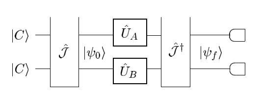
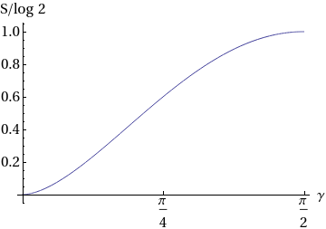

# 量子博弈论

## 简介

伴随着人们对量子力学的研究, 以及量子技术在社会生活中的发展, 尤其是以量子计算机为首的硬件发展, 越来越多的基于量子力学的跨学科研究开始进入研究者们的视野中. 如同计算科学结合的量子算法, 同信息科学结合的量子信息和量子加密等应用, 在最近数十年中更是发展的如火如荼. 在这个领域中, 有一个研究方向则是关注在量子力学大规模投入实用的背景下, 人的决策行为和社会成员之间的相互作用. 这就是量子博弈论的初衷. 在1999年, Mayer[1]首次提出量子博弈这个概念, 他指出, 一个经典上不存在严格占优策略的博弈, 可能会因为其中一方参与者拥有施行量子操作的能力而变得存在必胜结果. 而后由Eisert等人推广讨论了更复杂的一类博弈[2], 并且在他们的工作中提出了一种量子博弈的数学形式的协议. 尽管在21世纪初期量子博弈在物理和决策论社区中有着旺盛的兴趣, 但如今它的热度似乎冷却了下来[4]. 在本篇报告中, 我们将主要介绍博弈论的基本知识, 以及Mayer提出的零和量子博弈的工作和Eisert等人的量子博弈协议, 并讨论量子博弈的实际意义和未来的展望.

## 博弈论基础概念

博弈论是研究理性人之间的策略与作用的数学模型的学科, 它最初是为了研究经济中的各个参与者的行为, 但现在已经被发现在诸如生物学, 计算机科学等领域中有着种类繁多的应用. 本节中我们将从博弈论中最著名的一个模型: 囚徒困境出发来介绍博弈论的基础概念和对它们在真实世界中的一些理解.

囚徒困境描述的是两个参与者之间完全没有信息交流的博弈, 它的实际实现来自于单独审问两个囚徒, 如果二人都选择招供(对抗 \(D\))那么他们就都被处以惩罚, 而如果其中一个人不招供, 那么招供的人则会受到奖励但不招供的人则会受更大的惩罚. 如果二人都不招供(合作 \(C\)), 那么他们两个人就都只能受到较轻的惩罚. 这个博弈的数学模型可以这么来建立: 考虑两个参与者 \(A,B\), 他们每个人拥有两种可能的决策 \(C,D\). 并根据他们两人的决策配置来决定分配给二人的收益(其中的数值值仅仅代表不同情形下决策回报的序关系, 而不代表绝对数值. 其中 \(3\) 意味着轻处罚的回报, \(5\) 则对应着奖励, 而 \(0\) 对应更大的处罚, \(1\) 则为二人都不招供的时候的惩罚):

||\(A\) 选择 \(C\)|\(A\) 选择 \(D\)|
|--|---|---|
|\(B\) 选择 \(C\)|\(A\) 收益为 3, \(B\) 收益为 3| \(A\) 收益为 5, \(B\) 收益为 0|
|\(B\) 选择 \(D\)|\(A\) 收益为 0, \(B\) 收益为 5|\(A\) 收益为 1, \(B\) 收益为 1|

在博弈中, 我们假设参与的两人都知道彼此是理性的, 也就是说他们在任何情况下都将选择对自己最有利的决策. 在这个博弈中, 我们看到, 对于任意一个参与者来说, 不论对手的决策如何, 选择 \(D\) 都将给他更好的回报: 如果 \(B\) 选择 \(D\), 那么 \(A\) 选择 \(C,D\) 的回报为 \(0, 1\). 而如果 \(B\) 选择 \(C\), 那么则为 \(3, 5\). 因此在这个博弈中二人总是会选择 \(D\). 尽管事实上存在二人都选择 \(C\) 来获得 \(3\) 的回报, 但在两人无法交流的时候他们的理性决策却使得他们只能选择低收益的决策. 这种博弈被称为囚徒困境.

上面的这种博弈我们成为博弈的 **正则形式(normal form)**. 严格的数学定义如下:

> 一个正则形式的博弈 (game of normal form) 是指一个三元组: \(G=(N,(S_i)_{i\in N}, (u_i)_{i\in N})\), 其中:\
> 1.  \(N=\{1,2,\cdots\}\) 是一个有限大的参与者集合, 参与者成为 player\
> 2.  \(S_i\) 是参与者 \(i\) 的 (纯)策略 (pure strategy) 集合, 记 \(S=\prod_{i\in N} S_i\)
> 3.  \(u_i:S\rightarrow \mathbb{R}\) 是参与者 \(i\) 的回报, 一般的它是所有参与者策略的函数.

上面我们分析囚徒困境时找到的最终情况, 即二人各自选择 \(Y\) 决策并让整体未处在收益最大状态的策略配置, 事实上是著名的 Nash 均衡的概念:

> 一个正则形式博弈的(纯策略) Nash 均衡为一组策略配置, 即 \(S\) 中的元素: \(s^*\in S\) 使得:
> 对任意参与者 \(i\in N\), 策略 \(s^*\) 的第 \(i\) 个分量 \(s_i^*\) 是使得关于 \(x\in S_i\) 的函数: \(u_i(s_1^*,\cdots,s_{i-1}^*,x,s_{i+1}^*,\cdots,s_N^*)\) 最大的点

换句话说, 在 Nash 均衡状态每个参与者都实现了自己的理性: 任何一个参与者都无法在不改变其他人决策的前提下让自己的回报变得更大. 按照这个定义, 一个博弈的(纯策略) Nash 均衡可以不唯一, 但也有可能不存在. 而 Nash 的工作则是推广了策略集合的概念, 并且证明了在扩充的策略集合上博弈的 Nash 均衡总是存在的:

> 一个参与者的策略集合 \(S_i\) 上的混合策略是一组概率分布: \(\Delta(S_i) = \{(p_s)_{s\in S_i} : \sum_{s\in S_i} p_s = 1, p_s \geq 0\}\). 它的元素 \((p_s)\) 代表参与者将会有 \(p_s\) 的概率选择策略 \(s\).

而 Nash 的著名定理正是:

> 在一个有限多参与者的博弈中, 如果策略集合 \(S\) 是有限的, 那么在包含混合策略的策略集合 \(\prod_{i\in N} \Delta(S_i)\) 上使用期望回报函数 \((\mathbb{E}u_i)_{i\in N}\), 至少存在一个 Nash 均衡.

## 零和博弈的量子形式

在 Meyer 的1999年的文章[1]中, 他讨论了一种二人的零和博弈(即博弈的结果总是一胜一负. 数学的定义则为: 对博弈的任何一种结果, 都不存在另一种可能结果使得一方回报更高但不损失另一方的回报, 即每个结果都是 Pareto 最优的[3]): 考虑两个参与者 \(1,2\), 和一枚正面向上的硬币. 二人按照 \(2,1,2\) 的顺序选择是否要翻转硬币(参与者无法看到硬币的状态, 也无法看到对手的决策). 二人完成决策后打开盒子, 如果硬币正面向上那么 \(2\) 获胜. 不难看到, 这个博弈中如果三次决策中有偶数个翻转, 那么 \(2\) 获胜, 否则 \(1\) 获胜. 我们可以写出这个博弈的回报矩阵:

||NN|NF|FN|FF|
|--|--|--|--|--|
|N|-1|1|-1|1|
|F|1|-1|1|-1|

其中每一列对应一组 \(2\) 的策略, 每一行对应 \(1\) 的策略. 而数字代表 \(1\) 是否获胜. 作为零和博弈, 任意结果中 \(1,2\) 的回报之和为 \(0\), 即总是一方获胜一方输掉游戏.

Meyer 考虑了一个量子化的情况, 如果二人翻转的并非硬币而是一个二分量的自旋, 那么这个改变会为这个博弈带来什么影响? 在他的工作中他指出, 如果 \(2\) 被允许拥有量子的操作手段, 那么将会存在一种决策, 使得不论 \(1\) 的行为如何, 他都能够获得胜利. 即 \(1\) 依然只能选择翻转与否, 他的决策在自旋朝上和朝下的基下的矩阵形式为:

$$\bm{U}_F = \begin{bmatrix}0 & 1 \\ 1 & 0 \end{bmatrix} \ ; \ \bm{U}_N = \begin{bmatrix}1 & 0 \\ 0 & 1\end{bmatrix}$$

而 \(2\) 能够选择一种更普遍的操作方式, 即任意酉矩阵 \(\bm{U}\). 他指出, 当 \(2\) 选择操作(Hadamard 门):

$$\bm{U}_H = \frac 1 {\sqrt{2}}\begin{bmatrix}1 & 1 \\ 1 & -1 \end{bmatrix}$$

那么由于:

$$\forall \ \bm{U} \in \{\bm{U}_F,\bm{U}_N\} \Rightarrow \bm{U}_H \bm{U}\bm{U}_H = \begin{bmatrix}1 & 0 \\ 0 & 1 \end{bmatrix}$$

我们会看到不论 \(1\) 选择怎样的策略, 最终 \(2\) 都将会获胜.

## Eisert的量子博弈协议

### 量子的 \(2\times 2\) 博弈

Eisert 等人首次系统的给出了普遍的 \(2\times 2\) 型博弈(即两个参与者, 每个参与者的纯策略集合有两个元素)的量子化形式, 他们的模型设定是被广泛使用的量子博弈协议(quantum game protocal)中的一个.

博弈的参与者们各自拥有一个双态量子系统(如 \(1/2\) 的自旋), 他们只能在各自的子空间中操作这个量子系统. 整个博弈从一个给定初态和一个被所有参与者所知的初始化 \(\hat {\mathcal{J}}\) 开始(如果我们要求博弈是公平的, 那么初始化应当同置换算符对易), 两位参与者独立地给出他们的决策, 并经过一个已知的双比特门 \(\hat {\mathcal{J}}^\dagger\) 和测量仪器最终决定最后回报, 二人各自的自旋状态: \(\ket{C},\ket{D}\) 代表了他们的最终决策. 使用图示来表示即为:

最终的回报即为:

$$\text{payoff}_{\alpha} =\sum_{z\in \{CC,CD,DC,DD\}} u_{\alpha}(z)|\bra{z}\psi_f\rangle|^2 \ ; \ \alpha= A,B$$

其中

$$\ket{\psi_f} = \hat{\mathcal{J}}^\dagger (\hat U_A\otimes \hat U_B)\hat{\mathcal{J}}\ket{\psi_0}$$

由二人的量子决策决定. 最普遍的量子决策即为一般的 \(2\times 2\) 酉矩阵:

$$\bm{U}(\theta, \phi) = \begin{bmatrix}
e^{\ti \phi} \cos \theta/2 & \sin \theta/2\\
-\sin \theta/2 & e^{-\ti \phi} \cos \theta/2
\end{bmatrix}$$

以此为矩阵形式我们定义了算符 \(\hat U(\theta,\phi)\), 进而:

$$\hat U_{A,B} \in \{\hat U(\theta,\phi): \theta\in [0,\pi], \phi \in [0,2\pi)\}$$

### 经典博弈作为量子博弈的特殊情况

对应于经典操作, 我们有两个特殊的酉矩阵:

$$\bm{C} = \bm{U}(0,0) = \begin{bmatrix} 1 & 0 \\ 0 & 1\end{bmatrix} \ ; \ \bm{D} = \bm{U}(\pi,0) = \begin{bmatrix}0 & 1 \\ -1 & 0\end{bmatrix}$$

分别对应于选择不改变自旋方向和翻转自旋方向. 在我们的协议中, 为了能够让量子博弈包含经典博弈, 对初始化提出要求:

$$\forall \hat Z \in \{\hat C\otimes \hat C, \hat C\otimes \hat D , \hat D\otimes \hat C, \hat D\otimes \hat D\}\Rightarrow[\hat {\mathcal{J}}, \hat Z] = 0$$

与此同时, 由于:

$$\hat U(\theta,0) =\hat C \cos\theta/2 + \hat D \sin\theta/2$$

我们会看到经典的混合策略同样被包含在量子博弈中:

$$\Delta(\{C,D\}) = \{(p_C,p_D): p_C+p_D = 1, p_{C,D}\geq 0\} \sim \{\hat U(\theta,0) : \theta\in[0,\pi]\}$$

对应关系为: \(p_C = \cos^2\theta/2\).

### 量子囚徒困境

我们接下来讨论前面讨论过的囚徒困境的量子版本:

||\(A\) 选择 \(C\)|\(A\) 选择 \(D\)|
|--|---|---|
|\(B\) 选择 \(C\)|\(A\) 收益为 3, \(B\) 收益为 3| \(A\) 收益为 5, \(B\) 收益为 0|
|\(B\) 选择 \(D\)|\(A\) 收益为 0, \(B\) 收益为 5|\(A\) 收益为 1, \(B\) 收益为 1|

使用如下的初始化:

$$\hat {\mathcal{J}} = \exp\Big(\frac {\ti \gamma} 2 \hat D\otimes \hat D\Big)$$

不难验证它的确满足对易关系的要求, 同时 \(\gamma \in [0,\pi/2]\) 描述了初始化带来的初态的纠缠程度:

图中纵轴为 \(\hat {\mathcal{J}}\ket{CC}\) 的纠缠熵(以 \(\log 2\) 进行归一化), 即当 \(\gamma=\pi/2\) 是初始化的量子态拥有最大纠缠, 事实上:

$$\hat{\mathcal{J}}(\pi/2)\ket{CC} = \frac 1 {\sqrt{2}}\ket{CC} + \frac {\ti} {\sqrt{2}}\ket{DD}$$

当 \(\gamma=0\) 时, 博弈和经典情形相同. 二人均会选择 \(\hat C\) 并陷入囚徒困境. 但当 \(\gamma=\pi/2\) 时情况发生了变化, Eisert 等人指出, 此时事实上存在决策:

$$\hat Q = \hat U(0,\pi/2) \ ; \ \bm{Q} = \begin{bmatrix}
\ti & 0 \\ 0 & -\ti
\end{bmatrix}$$

而策略配置 \(\hat Q, \hat Q\) 将成为唯一的 Nash 均衡. 我们考虑当 \(B\) 选择 \(\hat Q\) 时 \(A\) 的理性决策:

$$\begin{aligned}
\text{payoff}_A(\theta,\phi) &=\frac 1 4\Big( u_A(CC)\times |\ti U_{CC}-\ti U_{DD}|^2\\
&\indent + u_A(CD)\times |U_{CD}-U_{DC}|^2 + u_A(DC)\times |\ti U_{CD}+\ti U_{DC}|^2 + u_A(DD) |U_{CC}+U_{DD}|^2\Big) \\
&=\frac 1 4\Big(u_A(CC) \sin^2 \phi \cos^2 \frac {\theta} 2 + u_A(CD)\sin^2 \frac \theta 2 + u_{A}(DD)\cos^2 \phi \cos^2 \frac {\theta} 2\Big)
\end{aligned}$$

在我们的回报矩阵中, 它正是:

$$\text{payoff}_A(\theta,\phi) = \frac 1 4 \Big(3 \sin^2\phi + \cos^2\phi\Big)\cos^2 \frac \theta 2$$

即最大值点在 \(\theta = 0, \phi = \pi/2\). 这个结论事实上并不要求 \(u_A\) 的具体数值, 只需要有 \(u_A(CC)\gt u_A(DD)\gt u_A(CD)\) 的序关系, 而囚徒困境事实上正是基于这个序关系而出现的. 因此这个结论事实上适用于普遍的囚徒困境博弈. 因此我们找到了量子囚徒困境中的一个 Nash 均衡: 二人均选择决策 \(\hat Q\). Eisert 等人指出这个均衡事实上是最大纠缠初始化下的唯一的 Nash 均衡, 而且这个均衡对应着一个 Pareto 最优的结果. 换言之, 最大纠缠初始化下的量子囚徒困境博弈不再是一个困境, 二人的理性决策使他们达到了最优回报结果: 不可能再找到一个配置, 在不损害一方的收益的前提下增加另一方的回报.

## 量子博弈展望

在 Eisert 等人给出的量子博弈的定义中, 我们事实上发现量子博弈并非为博弈论带来了新的内容. 至少量子化的 \(2\times 2\) 型博弈依旧能够在经典框架下进行求解. 事实上正如我们能够在经典计算机上模拟出小规模的量子过程, 量子博弈总是能够写为经典博弈的形式, 唯一的区别只是量子博弈的策略集合 \(S\) 远大于经典的策略集合. 从这个意义上讲, 量子博弈在思辨上并没有开辟新的领域. 甚至于在 Meyer 的不公平博弈(其中一个参与者能够使用量子操作)和 Eisert 的量子囚徒困境中, 他们发现的结论也并不是令人惊讶的: 在扩充的策略集合的支持下必胜解和逃离困境总是可以做到的, 这些情景在经典博弈中也并非没有.

而如果考虑量子博弈在技术上带来的影响, 我们事实上会发现它有着相当广阔的应用前景. 博弈论最初是为了解释经济中参与者们的理性决策和带来的影响而被建立起来的数学理论, 这也是为什么它一开始的策略集合和分析都是基于经典情形来完成的. 而如果未来的某一天量子技术相当高程度发展使得参与者们能够使用量子计算机作为代理人甚至直接以量子过程来进行交互时, 量子博弈的研究也就有了需求. 但这依赖于技术的发展, 在最近的数十年很可能我们无法拥有能够取代经典计算机的量子硬件, 因此对量子博弈的需求恐怕并不会很大[4, 5]. 但一方面并不应当以此来否定量子博弈的存在意义, 另一方面正如量子计算的发展, 量子博弈很可能能够同经典博弈进行一定程度的结合, 为我们带来一种混合形式的博弈[6]. 同时, 在考虑到量子性的情况下, 研究人的行为同样也在心理学, 社会学等领域边的活跃. 而且随着量子力学概念的普及, 如量子国际象棋[9]等基于量子过程的游戏也应运而生. 这个领域应当在不远的未来会变得更加活跃.

量子博弈协议的制定同样是一个开放问题. Eisert 等人的协议并非是唯一的, 但是最早提出的. 它可能是被最广泛应用的协议, 但同样也在经受质疑. 在综述工作[5]中同样列举了数个其他协议, 这个领域作为纯粹思辨的考量仍然有人在进行研究. 而同时对量子博弈本身定义的思考同样也出现在社区中.  除了仅仅从形式上为经典博弈引入量子决策外, 同样有人再考虑人脑本身作为量子系统在博弈中的地位, 甚至分子层面上如蛋白质的博弈过程[6].

## 参考文献

1.  Meyer, D. A. (1999). Quantum strategies. Physical Review Letters, 82(5), 1052–1055. https://doi.org/10.1103/PhysRevLett.82.1052
2.  Jens Eisert, Martin Wilkens, and M. L. (2013). Quantum games and quaternionic strategies. Quantum Information Processing, 12(8), 2701–2720. https://doi.org/10.1007/s11128-013-0553-5
3.  R. B. Myerson, Game Theory: An Analysis of Conflict (MIT Press, Cambridge, MA, 1991).
4.  Huang, D., & Li, S. (2018). A survey of the current status of research on quantum games. 2018 4th International Conference on Information Management, ICIM 2018, 46–52. https://doi.org/10.1109/INFOMAN.2018.8392807
5.  Khan, F. S., Solmeyer, N., Balu, R., & Humble, T. S. (2018). Quantum games: a review of the history, current state, and interpretation. Quantum Information Processing, 17(11), 1–41. https://doi.org/10.1007/s11128-018-2082-8
6.  Guo, H., Zhang, J., & Koehler, G. J. (2008). A survey of quantum games. Decision Support Systems, 46(1), 318–332. https://doi.org/10.1016/j.dss.2008.07.001
7.  FLITNEY, A. P., & ABBOTT, D. (2002). an Introduction To Quantum Game Theory. Fluctuation and Noise Letters, 02(04), R175–R187. https://doi.org/10.1142/s0219477502000981
8.  Grabbe, J. O. (n.d.). An Introduction to Quantum Game Theory.
9.  https://quantumfrontiers.com/
